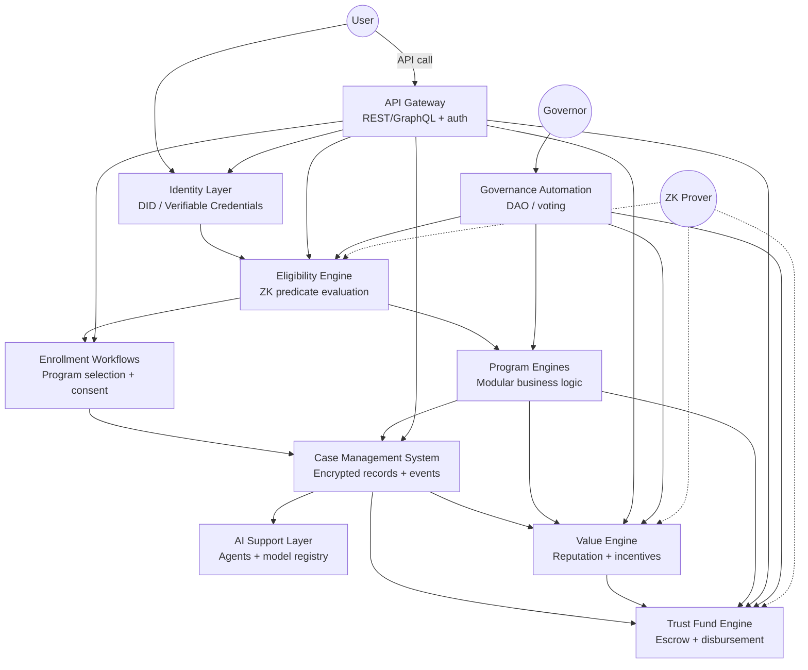

Generate plugin-style modules for HSN that can be added or removed without breaking the core system.

Examples:
- Local nonprofit connectors
- School district connectors
- Workforce development connectors
- Mental health provider connectors
- Housing provider connectors
- Payment processors
- Identity verification providers

Deliver:
- Plugin architecture
- Interface contracts
- Example plugin
- Governance rules for plugins

Human Stability Network – Repository Scaffolding & Core Architecture

Part 1: Starting-Phase Scaffolding for the Human Stability Network Repository

Folder Structure

```
human-stability-network/
├── .github/
│   ├── workflows/
│   │   ├── ci.yml
│   │   └── deploy.yml
│   ├── app-integration/
│   │   └── github-app-placeholder.md
│   └── CODEOWNERS
├── docs/
│   ├── mission-philosophy.md
│   ├── architecture-overview.md
│   └── glossary.md
├── contracts/
│   ├── smart-contracts/          # Solidity / CosmWasm stubs
│   └── zk-circuits/              # Circom / ZoKrates stubs
├── programs/
│   ├── program-index.md
│   ├── basic-income/
│   ├── mental-health/
│   ├── skills-training/
│   └── emergency-relief/
├── governance/
│   ├── governance-index.md
│   ├── dao/
│   └── proposals/
├── ai-support-layer/
│   ├── ai-support-layer-index.md
│   ├── agents/
│   └── models/
├── value-engine/
│   ├── value-engine-index.md
│   ├── reputation/
│   └── incentives/
├── youth-track/
│   ├── youth-track-index.md
│   ├── mentorship/
│   └── education/
├── trust-fund/
│   ├── trust-fund-index.md
│   ├── escrow/
│   └── disbursement/
├── security/
│   ├── security.md
│   ├── threat-model.md
│   └── audits/
├── contributing/
│   ├── contribution-template.md
│   ├── code-of-conduct.md
│   └── pull-request-template.md
├── .gitignore
├── LICENSE
└── README.md
```

Starter Files

README.md (Outline)

```markdown
# Human Stability Network

> Decentralized infrastructure for universal human stability — income, care, and belonging.

## Mission
To guarantee every person the material and social conditions for a stable life, using zero‑knowledge proofs, distributed governance, and AI‑augmented casework.

## Philosophy
- **Stability as a public good** – not charity, not conditional aid.
- **Privacy by default** – eligibility proven without revealing personal data.
- **Local + global** – programs adapt to cultures, funded by a shared trust fund.
- **Open contribution** – anyone can build a program, propose a rule, or run a node.

## Quick start
```bash
git clone https://github.com/hsn/core.git
cd human-stability-network
make setup
```

Repository structure

Folder Purpose
/programs Pluggable intervention modules (UBI, mental health, etc.)
/governance DAO specs, proposal templates, voting logic
/ai-support-layer LLM agents for case triage & decision support
/value-engine Reputation, incentives, and stablecoin mechanics
/youth-track Age‑specific stability pathways (16–25)
/trust-fund Capital pools, escrow, conditional disbursement
/contracts Smart contracts & ZK circuits
/security Audits, threat models, key management

Contributing

See CONTRIBUTING.md and CODE_OF_CONDUCT.md.

License

AGPL‑3.0 + Commons Clause (ethical use only)

```

#### `LICENSE`
AGPL‑3.0 (full text truncated for brevity, but include standard header).

#### `.gitignore`
```

node_modules/
.env
*.log
dist/
build/
coverage/
*.pem
*.key
*.zkproof

```

#### `contributing/contribution-template.md`
```markdown
# Contribution Template

## Type of change
- [ ] New program
- [ ] Governance proposal
- [ ] AI model / agent
- [ ] Security fix
- [ ] Documentation

## Summary
(Explain what this adds/changes and why)

## Privacy & security review
- [ ] Does this require new ZK circuits?
- [ ] Does this handle PII?
- [ ] Has it been tested with mock data?

## Testing checklist
- [ ] Unit tests pass
- [ ] Integration tests pass (if applicable)
- [ ] Eligibility engine simulation

## Sign-off
I agree to the [Code of Conduct](./code-of-conduct.md) and to license this contribution under AGPL‑3.0.
```

contributing/code-of-conduct.md

Standard Contributor Covenant v2.1 with additional clause: “No surveillance or re‑identification of beneficiaries.”

security/security.md

```markdown
# Security Policy

## Reporting
Submit via `security@hsn.org` (PGP key in `/security/pgp-key.asc`).  
Do **not** use GitHub issues.

## Accepted risks
- Sybil resistance is probabilistic
- AI decisions are auditable but not infallible

## Disclosure timeline
- Critical: 72h fix, 7d public
- Moderate: 14d fix, 30d public
```

.github/workflows/ci.yml

```yaml
name: CI
on: [push, pull_request]
jobs:
  test:
    runs-on: ubuntu-latest
    steps:
      - uses: actions/checkout@v4
      - name: Run eligibility engine tests
        run: make test-eligibility
      - name: Lint programs
        run: make lint-programs
      - name: ZK circuit compilation (stub)
        run: echo "ZK compile placeholder"
```

.github/workflows/deploy.yml

```yaml
name: Deploy
on:
  release:
    types: [published]
jobs:
  deploy:
    runs-on: ubuntu-latest
    steps:
      - name: Deploy to testnet
        run: make deploy-testnet
      - name: Governance proposal preparation
        run: make governance-proposal
```

.github/app-integration/github-app-placeholder.md

```markdown
# GitHub App Integration Placeholder

When live, the HSN GitHub App will:
- Auto‑label contributions by program area
- Run ZK proof verification on PRs that modify eligibility rules
- Post a comment with “governance gas estimate”
- Gate merges behind a threshold of reputation from the Value Engine

Installation URL: (to be added)
Webhook secret: `${{ secrets.HSN_WEBHOOK }}`
```

Index Files (examples)

programs/program-index.md

```markdown
| Program ID | Name | Eligibility (ZK predicate) | Disbursement |
|------------|------|----------------------------|---------------|
| P001 | Universal Basic Income | `age >= 18 AND income < M` | Stablecoin monthly |
| P002 | Youth Mental Health | `age 16-25 AND PHQ9 >= 10` | 8 therapy vouchers |
| P003 | Emergency Relief | `loss_event == true AND days_since_loss <= 7` | One‑time 500 USDC |
```

governance/governance-index.md

Lists active DAO modules: proposal factory, veto power of Stability Council, quadratic voting parameters.

ai-support-layer/ai-support-layer-index.md

```markdown
- **Triage Agent** – NLP classifier routes to correct program
- **Eligibility Explainer** – LLM generates human‑readable reasons (post‑ZK proof)
- **Case Notes Summarizer** – differential privacy layer
- **Model registry** (Hugging Face + ZK model proofs)
```

value-engine/value-engine-index.md

· Reputation tokens (ERC‑20 / Cosmos Coin) – non‑transferable
· Contribution scoring (code, casework, governance)
· Incentive pools: quadratic funding, retroactive public goods

youth-track/youth-track-index.md

· Mentorship matching engine (off‑chain + ZK age range)
· Skills wallet (verifiable credentials for achievements)
· Transition fund (escrow unlocks at 25)

trust-fund/trust-fund-index.md

· Capital sources: taxes, donations, yield
· Escrow contracts (multi‑sig + ZK condition release)
· Disbursement oracles (Chainlink + HSN‑run nodes)

---

Part 2: Core System Architecture

Mermaid Architecture Diagram



Module Descriptions

Module Responsibility Key Tech
Identity Layer Issuance of DIDs, storage of encrypted credentials, selective disclosure. did:key, BBS+ signatures, IPFS/Hypercore
Eligibility Engine Evaluate ZK predicates (age, income, location, health score) without raw data. Circom, ZoKrates, snarkJS
Enrollment Workflows Multi‑step sign‑up, consent management, program assignment. State machines, XState, session tokens
Case Management System Encrypted case notes, document store, event sourcing, role‑based access. Lit Protocol, OrbitDB, OPA policies
AI Support Layer LLM triage, summarisation, anomaly detection; model inference with ZK provenance. Ollama, vLLM, ezkl
Value Engine Non‑transferable reputation scores, contribution graphs, retroactive funding pools. Ceramic, Compass, Halo2
Trust Fund Engine Multi‑sig escrow, conditional disbursement (ZK conditions), yield management. Safe, Aztec, Chainlink
Program Engines Pluggable logic for UBI, mental health, skills training, etc. WASM modules, CosmWasm
API Gateway Unified entry point, rate limiting, authentication, request routing. Envoy, GraphQL federation
Governance Automation Proposal submission, quadratic voting, veto logic, on‑chain execution. Aragon OSx, Tally

Data Flow (Simplified)

1. User creates DID → Identity Layer stores encrypted profile.
2. User requests eligibility → API Gateway → Eligibility Engine.
   · User generates ZK proof (e.g., age>18 && income<X) locally.
   · Engine verifies proof → returns eligible: [P001, P003].
3. User enrolls → Enrollment Workflows → selects program, signs consent.
4. Case created → Case Management System stores encrypted record.
5. Ongoing support:
   · AI Support Layer reads case events (permissions) → suggests actions.
   · Value Engine updates reputation based on positive outcomes.
6. Disbursement → Trust Fund Engine checks ZK condition → releases funds.
7. Governance → Token holders propose new eligibility rule → passes vote → Governance Automation updates Eligibility Engine.

API Surfaces (REST + GraphQL)

Identity Layer

```
POST   /identity/did              – Create DID
POST   /identity/credential       – Issue credential
GET    /identity/credential/:id   – Retrieve encrypted credential
POST   /identity/prove            – Generate ZK proof from credentials
```

Eligibility Engine

```
POST   /eligibility/verify        – Submit ZK proof, get program list
GET    /eligibility/rules         – List public rule hashes
```

Enrollment Workflows

```
POST   /enrollment/begin          – Start enrollment for program X
PUT    /enrollment/consent        – Sign consent (off‑chain or on‑chain)
GET    /enrollment/status/:userId – Current enrollment state
```

Case Management

```
POST   /cases                     – Create new case
POST   /cases/:caseId/events      – Append encrypted event
GET    /cases/:caseId             – Read case (auth + ZK access proof)
```

Value Engine

```
GET    /reputation/:userId        – Reputation score (ZK‑proof required)
POST   /contribution              – Register contribution (code, casework, etc.)
POST   /incentive/claim           – Claim retroactive reward
```

Trust Fund Engine

```
GET    /funds/balance/:programId  – Current escrow balance
POST   /funds/disburse            – Request disbursement (ZK condition proof)
GET    /funds/history             – Auditable disbursement log
```

Governance Automation

```
POST   /governance/proposal       – Submit new proposal
GET    /governance/proposals      – List active proposals
POST   /governance/vote           – Cast vote (quadratic)
```

Security Model

· Zero‑trust network – all inter‑service calls authenticated with mTLS or JWTs.
· End‑to‑end encryption for case data (user holds key, service only sees encrypted blobs).
· Role‑based access (RBAC) with OPA policies:
  · case_worker → read/write assigned cases, no raw identity.
  · ai_agent → read anonymised case summaries, no PII.
  · auditor → read ZK proof transcripts, no plaintext.
· Key management – HSMs for trust fund signers; user DIDs stored client‑side.
· Rate limiting & DDoS protection – per‑DID quota, API Gateway circuit breakers.
· Formal verification for eligibility engine predicates (using Coq or SMT solvers).

ZK‑Proof Integration Points

Integration Point What is proved Without revealing
Eligibility Age ≥ 18, income ≤ threshold, residency in region Exact age, income, address
Mental health program PHQ‑9 score ≥ 10 Individual answers, raw score
Reputation User has contributed ≥ 5 hours last month Which project, exact time
Trust fund disbursement Condition (enrolled && attended_80%) Attendance list, class details
Governance vote Voter holds ≥ 100 reputation (non‑transferable) Voter identity (pseudonymous)
Audit Program X disbursed exactly Y funds to eligible users Recipient identities

ZK circuit libraries:

· circom + snarkjs for eligibility predicates.
· halo2 for reputation and governance proofs.
· aztec‑nr for private trust fund conditions.

Proof verification on‑chain (Ethereum/Celestia) for trust fund releases, off‑chain (API gateway) for eligibility and reputation queries.

---

End of architecture document. Ready to paste into a new repository


Generate feature-level specifications for all HSN programs:

Programs:
- Housing
- Food & Essentials
- Unlimited Phone
- Desktop Access
- Youth Education
- Teen Financial Literacy
- Protected Youth Trust Fund
- Healthcare Access
- AI Support Layer

For each:
- Purpose
- Eligibility rules
- Enrollment workflow
- Case management workflow
- AI agent integration
- Funding logic
- Metrics + KPIs
- Risks + mitigations

Feature-Level Specifications for HSN Programs

1. Housing

Purpose
Prevent homelessness and stabilize housing costs by providing rental subsidies, security deposits, or transitional housing vouchers.

Eligibility rules

· ZK predicate: housing_cost_ratio > 0.4 AND income < local_median_income * 0.5
· Or: literally_homeless == true (proved via shelter or affidavit with ZK)
· One‑time per 24 months unless homelessness recurs.

Enrollment workflow

1. User proves income/rent ratio via ZK (no raw numbers to HSN).
2. System returns eligible programs.
3. User selects housing voucher type (direct landlord payment or escrow).
4. Digital consent signed; case created.

Case management workflow

· Case worker receives encrypted notification of new housing case.
· Worker uploads landlord details, lease term (encrypted).
· Monthly check‑in: user provides ZK proof of continued tenancy (e.g., utility bill hash).
· If missed two check‑ins, case flagged for follow‑up (automated SMS via AI agent).

AI agent integration

· Eviction risk predictor – analyses anonymised payment patterns (no PII) to flag cases for proactive outreach.
· Landlord matching – recommends nearby landlords accepting vouchers.
· Chatbot – answers common Qs: “How to report a repair?”.

Funding logic

· Monthly rent paid directly to landlord from Trust Fund Engine, conditional on ZK tenancy proof.
· Security deposit held in escrow; returned to user after lease end minus damages (adjudicated via governance vote if dispute).
· Budget per region capped at 20% of local trust fund allocation.

Metrics + KPIs

· Days to placement after enrollment.
· Eviction rate among participants vs control.
· Average subsidy as % of rent.
· Landlord participation rate.

Risks + mitigations

Risk Mitigation
Landlord fraud Escrow plus on‑chain lease hash; reputation scoring for landlords
User misses check‑in Grace period + AI SMS reminder; human outreach after 30 days
Sybil attack ZK uniqueness proof (e.g., government ID hash without revealing ID)

---

2. Food & Essentials

Purpose
Guarantee weekly access to nutritious food, hygiene products, and household essentials via prepaid grocery cards or community pickup points.

Eligibility rules

· ZK predicate: income < local_median_income * 0.3 OR (household_size > 4 AND income < M*0.4)
· Or: snap_eligible == true (state benefit cross‑proof)
· No cooldown; weekly renewal.

Enrollment workflow

1. User generates ZK proof of income/household size.
2. System returns “eligible for $X per week”.
3. User chooses digital card (virtual Visa) or pickup location.
4. Optional: link to grocery loyalty program (privacy‑preserving).

Case management workflow

· Auto‑renewal each week unless user unsubscribes.
· If card is unused for 14 days, AI agent asks “Need help?” via SMS.
· Case worker can increase temporary amount (e.g., for medical diet) with ZK doctor note.

AI agent integration

· Dietary constraint agent – suggests allergen‑safe products (no raw health data; uses ZK proof of allergy class).
· Waste reduction – predicts local surplus food, invites user to pickups.
· Fraud detection – unusual purchase patterns (e.g., resale) flagged to human auditor.

Funding logic

· Weekly budget: $25 per adult, $15 per child (US baseline, CPI‑adjusted).
· Funds loaded onto privacy‑preserving payment rail (e.g., zk‑rollup stablecoin).
· Unused funds returned to trust fund after 30 days.

Metrics + KPIs

· Redemption rate (cards used).
· Nutritional quality score (by product category).
· Food insecurity reduction (survey ZK‑anonymised).

Risks + mitigations

Risk Mitigation
Resale of benefits Restricted merchant codes (grocery only); ML anomaly detection
Insufficient for special diets Extra top‑up with medical proof (ZK)
Geographic gaps Partner with local pantries as fallback

---

3. Unlimited Phone

Purpose
Provide free, unlimited talk/text/data to ensure connectivity for job searches, healthcare, education, and emergency services.

Eligibility rules

· ZK predicate: income < local_median_income * 0.5 AND (job_seeker == true OR student == true OR caregiver == true)
· One per adult in household.

Enrollment workflow

1. User proves eligibility.
2. HSN issues a SIM profile (e‑SIM or physical SIM) via partner carrier.
3. User activates phone (BYOD or low‑cost device from device pool).
4. Optional: port existing number.

Case management workflow

· Automated monthly usage report (no content, only volume).
· If no usage for 60 days, case flagged for dormancy.
· User can request device upgrade (e.g., smartphone) with ZK proof of job training enrollment.

AI agent integration

· Usage advisor – suggests data‑saving tips; notifies when nearing fair‑use cap.
· Emergency alert – if user calls 911 (or local emergency) and is homeless, AI sends coordinates to outreach team (opt‑in).
· Digital literacy coach – interactive SMS bot for basic phone skills.

Funding logic

· Bulk MVNO agreement: cost per line ~$10–15/month.
· Trust fund pays carrier monthly based on active lines.
· Device pool funded by donations + value engine rewards.

Metrics + KPIs

· Active lines per month.
· Average data usage.
· Job placement rate among users (correlation, not causation).

Risks + mitigations

Risk Mitigation
Abuse (robo‑calling) Carrier‑side spam filters; revoke line after warning
SIM swap fraud Biometric authentication for support calls
Carrier goes bankrupt Multi‑carrier redundancy, fallback to community wireless

---

4. Desktop Access

Purpose
Provide a refurbished laptop/desktop + internet hotspot to enable remote work, online learning, and digital skill building.

Eligibility rules

· ZK predicate: (student == true OR job_training_enrolled == true) AND no_household_computer == true
· One per household, renewable every 3 years.

Enrollment workflow

1. User proves enrollment in education/training and lack of device.
2. Choose device type (laptop, desktop, Chromebook).
3. Pay refundable deposit (reduced to $0 for extreme poverty – ZK proved).
4. Device shipped or picked up at partner library.

Case management workflow

· Device serial number recorded on‑chain (private).
· User agrees to basic care terms (no resale).
· If device not online for 90 days, case worker contacts.
· End of term: user returns device or proves continued need.

AI agent integration

· Device health monitor – remote diagnostic (with consent) suggests cleaning or repair.
· Learning pathway recommender – based on user’s goal (job type, course).
· IT support bot – common issues (Wi‑Fi, printer) solved via chat.

Funding logic

· Refurbishers paid per device delivered.
· Hotspot data plan paid monthly by trust fund.
· Deposit held in escrow; forfeited if device not returned.

Metrics + KPIs

· Device uptime (>95% online hours).
· Job/education enrollment increase after receipt.
· Repair turnaround time.

Risks + mitigations

Risk Mitigation
Device resale Tamper‑evident BIOS lock; ZK proof of possession required monthly
Breakage User pays reduced repair fee or completes digital literacy course
Theft Reporting allows remote lock; replacement at 50% cost

---

5. Youth Education (Ages 12–17)

Purpose
Ensure secondary‑level access to tutoring, school supplies, internet stipends, and after‑school programs.

Eligibility rules

· ZK predicate: age 12-17 AND (household_income < M*0.4 OR foster_care == true)
· Automatic if enrolled in free lunch program (school partner oracle).

Enrollment workflow

1. Parent/guardian proves child’s age and income (ZK).
2. System assigns education coach (volunteer or paid).
3. User selects needs: tutoring subjects, supply kit, or hotspot.
4. Consent signed; child assent (age‑appropriate).

Case management workflow

· Coach checks in bi‑weekly via encrypted chat.
· School attendance data (anonymised) pulled via connector.
· If grades drop below C, AI suggests intervention.
· Transition at 18 to adult programs.

AI agent integration

· Homework helper – LLM that explains concepts, doesn’t do the work.
· Attendance predictor – flags risk of dropout.
· Supply demand – predicts which schools need backpack donations.

Funding logic

· Per‑student budget: $50/month for tutoring, $20/month for supplies.
· Tutor payments via value engine (reputation + hours).
· Supplies purchased in bulk, distributed via schools.

Metrics + KPIs

· Grade improvement (subject‑specific).
· High school graduation rate.
· Coach retention.

Risks + mitigations

Risk Mitigation
Coach misconduct Background check (ZK privacy‑preserving), session recording with consent
Child privacy Parent dashboard, no direct AI chat without parent access
Dropout despite support Escalate to school counsellor (human)

---

6. Teen Financial Literacy (Ages 14–19)

Purpose
Teach budgeting, saving, investing, and crypto basics through gamified modules and a simulated economy.

Eligibility rules

· ZK predicate: age 14-19 AND (enrolled_in_school OR ged_track)
· No income test – universal for teens in need.

Enrollment workflow

1. Teen proves age range via ZK (e.g., from school ID hash).
2. Access to “Stability Sim” app – a virtual bank account with HSN dollars.
3. Parent optional view only.

Case management workflow

· Automated progress tracking through modules.
· Peer mentor (older teen) assigned after first module.
· Virtual “emergency” scenarios (car repair, job loss) trigger AI coaching.

AI agent integration

· Budget coach – analyses spending choices in simulator, gives tips.
· Scam detector – alerts when simulated phishing attempt succeeds.
· Career linker – after completing investing module, suggests teen‑friendly jobs.

Funding logic

· Free app; no real money involved.
· Real rewards (e.g., $20 gift card) upon completing 5 modules – paid from trust fund.
· Schools may sponsor leaderboards.

Metrics + KPIs

· Module completion rate.
· Pre/post financial literacy quiz score.
· Number who open real bank account (via partner bank, ZK linked).

Risks + mitigations

Risk Mitigation
Simulated losses cause distress Warnings that it’s a game; access to teen counsellor
Crypto speculation promotion Only teach stablecoins and DCA, no trading
Cheating ZK proofs of module completion (unique session)

---

7. Protected Youth Trust Fund (Ages 0–25)

Purpose
A custodial, inflation‑protected savings account that unlocks at age 25, seeded by government, donors, or family contributions.

Eligibility rules

· Age ≤ 25 at enrollment.
· Any child or youth (no income test).
· One account per SSN‑hash (ZK unique).

Enrollment workflow

1. Parent/guardian creates trust fund for child (or youth self‑enrolls if 16+).
2. HSN generates a shielded Zcash/Sapling address for the fund.
3. Initial seed (e.g., $500) deposited from public funds.
4. Fund balance viewable but not withdrawable until age 25.

Case management workflow

· Annual statement sent to guardian (encrypted).
· If child goes into foster care, custody of fund transferred to HSN governance (with court proof).
· At age 25, funds are released after ZK proof of age and completion of stability survey (optional).

AI agent integration

· Projection bot – shows estimated balance at 25 with compound interest.
· Contribution match – suggests when relatives donate, AI triggers match from value engine.
· Fraud alert – if unusual contribution patterns (money laundering), flag to auditor.

Funding logic

· Assets held in a diversified index fund or on‑chain stable yield (e.g., stETH).
· Withdrawals before 25 allowed only for medical emergency or education (governance vote).
· Management fee: 0.5% capped.

Metrics + KPIs

· Average balance at 25.
· Number of youth who avoid predatory lending due to fund.
· Percentage of funds used for housing/education after release.

Risks + mitigations

Risk Mitigation
Inflation erosion Inflation‑linked bond or Bitcoin (small %)
Parental theft Multi‑sig: youth + guardian + HSN oracle
Lost access at 25 Recovery social recovery (trusted contacts)

---

8. Healthcare Access

Purpose
Subsidise primary care visits, mental health therapy, prescriptions, and dental care for uninsured or underinsured individuals.

Eligibility rules

· ZK predicate: (uninsured == true AND income < M*0.6) OR chronic_condition == true
· Or: referred by another HSN program (e.g., housing case worker).

Enrollment workflow

1. User proves lack of insurance via ZK (e.g., no active policy ID).
2. HSN issues a virtual health debit card (limited merchant category: clinics, pharmacies).
3. User selects preferred provider from HSN network.

Case management workflow

· After each visit, provider submits encrypted claim (no diagnosis, only procedure code).
· AI checks for billing anomalies.
· If user misses two appointments, case worker calls.
· Annual recertification.

AI agent integration

· Symptom checker – differential privacy; suggests urgent vs routine care.
· Medication reminder – SMS/chatbot.
· Provider rating – aggregates anonymised satisfaction scores.

Funding logic

· Per‑visit copay covered (e.g., $30 primary, $60 mental health).
· Prescription discount card (negotiated rates).
· Annual cap: $2,500 per person, except chronic conditions (uncapped with ZK proof).

Metrics + KPIs

· Preventive care visits per 1000.
· ER visit reduction among participants.
· Average out‑of‑pocket cost saved.

Risks + mitigations

Risk Mitigation
Overutilization (unnecessary visits) AI prior auth for expensive procedures
Provider fraud Audited claims; provider reputation score
User still avoids care due to stigma Anonymised telehealth option

---

9. AI Support Layer (Cross‑cutting)

Purpose
Provide a unified, privacy‑preserving AI suite that assists case workers, beneficiaries, and governance bodies without storing raw personal data.

Eligibility rules

· All enrolled HSN members (any program) can access basic AI agents.
· Advanced agents (e.g., predictive risk) require opt‑in consent.

Enrollment workflow

· Automatically provisioned when user joins any HSN program.
· User sets privacy preferences (e.g., “no AI reading my case notes” – only rule‑based).
· Optional voice interface enrollment.

Case management workflow

· AI agents run as microservices, reading only encrypted data for which they have a decryption capability (via Lit Protocol or ZK decryption).
· Each agent logs its inferences to an audit trail (no PII).
· Users can contest an AI decision (e.g., “why did my eligibility change?”) – the Eligibility Explainer agent responds with ZK proof of logic.

AI agent integration (detailed)

Agent Function Privacy technique
Triage Routes user to correct program Minimal data; discards after routing
Eligibility Explainer Natural language reasons for approval/denial ZK proof of rule execution
Case Summariser Monthly digest for case worker Differential privacy (ε=1)
Anomaly Detector Flags potential fraud or need Homomorphic encryption for aggregation
Sentiment Analyst Detects distress in chat logs (opt‑in) On‑device inference, only sends flags

Funding logic

· Compute costs covered by trust fund (budgeted as 2% of total disbursements).
· Model training funded via value engine’s retroactive public goods.
· Open models only (LLaMA, Mixtral) – no proprietary APIs.

Metrics + KPIs

· Agent accuracy (precision/recall on held‑out test set).
· Average response latency.
· User satisfaction score (post‑chat survey).
· Number of successful contestations of AI decisions.

Risks + mitigations

Risk Mitigation
Bias against minorities Regular fairness audits with synthetic data; model cards
Hallucination (giving wrong advice) Confidence threshold; human‑in‑the‑loop for critical actions
Privacy leak via model outputs No free‑text case notes returned; use canonical responses

---

Optional Bonus Features

1. Community Dashboards

Feature list

· Public dashboard of total funds disbursed, programs active, users served (no PII).
· Private dashboard for case workers (their caseload, outcomes).
· Governance dashboard (proposals, votes, treasury health).

Value justification
Transparency builds trust; case workers need real‑time stats; governance requires visibility.

Implementation outline

· Stream data from Trust Fund, Case Management, and Value Engine to a data warehouse (e.g., ClickHouse).
· Use Superset or Metabase with row‑level security.
· Update every 6 hours (ZK‑aggregated).

Dependencies

· Data pipeline (Kafka, Debezium).
· Role‑based API gateway.

---

2. Contributor Recognition

Feature list

· Badges (NFT or on‑chain) for code contributions, casework hours, governance participation.
· “Stability Stars” leaderboard (opt‑in).
· Retroactive funding via Value Engine based on contributor impact.

Value justification
Motivates volunteer developers, social workers, and community organisers.

Implementation outline

· GitHub app integration (from earlier) mints badges on merged PR.
· Case management system reports hours (ZK anonymised).
· Quadratic funding pool each quarter.

Dependencies

· Value Engine reputation contract.
· NFT minter (EVM/Cosmos).

---

3. AI‑Powered Progress Tracking

Feature list

· Personalised “stability score” (user‑only, not shared).
· Milestone predictions (“you’re on track to finish job training in 3 months”).
· Early warning for case workers (e.g., “user likely to drop out”).

Value justification
Proactive support reduces failure; empowers users.

Implementation outline

· Train a small transformer on synthetic case histories (no real PII).
· Expose as an API inside AI Support Layer.
· UI widget in user dashboard.

Dependencies

· Synthetic data generator.
· Model registry (Hugging Face + ZK provenance).

---

4. Local Partner Integrations

Feature list

· Plug‑in connectors to food banks, shelters, clinics.
· Shared eligibility oracle (so user doesn’t re‑prove for each partner).
· Partner dashboard for resource availability.

Value justification
Reduces duplication; leverages existing community infrastructure.

Implementation outline

· Use Plugin Architecture (see next section).
· Partner signs data sharing agreement; HSN provides ZK proof relay.
· REST API for partners to query “Is this user eligible for food?” (yes/no only).

Dependencies

· Plugin registry.
· OAuth for partners.

---

5. Emergency Response Mode

Feature list

· One‑button activation during natural disaster or economic crash.
· Waives standard eligibility rules (e.g., income test).
· Increases disbursement caps; prioritises housing, food, healthcare.

Value justification
HSN must be anti‑fragile; fast response saves lives.

Implementation outline

· Governance‑controlled switch (or trusted oracle for declared emergency).
· Pre‑approved emergency budget (5% of trust fund).
· SMS/IVR enrollment for those without internet.

Dependencies

· Governance automation (emergency vote).
· Mass notification system.

---

6. Offline‑First Youth Support

Feature list

· Mobile app that works without internet (sync when online).
· SMS chatbot for feature phone users.
· Printable forms with QR codes for ZK proof generation at kiosks.

Value justification
Many youth lack reliable internet; offline mode ensures inclusion.

Implementation outline

· PWA with local storage + IndexedDB.
· Twilio for SMS.
· Kiosk software (Raspberry Pi) installed at libraries.

Dependencies

· Sync service (CouchDB replication).
· SMS gateway.

---

7. Multi‑Language Support

Feature list

· UI and AI agents in 20+ languages (starting with English, Spanish, Mandarin, Arabic, Swahili).
· Real‑time translation of case notes (encrypted, user‑controlled).
· Culturally adapted eligibility rules (e.g., different income thresholds).

Value justification
HSN is global; language barriers exclude.

Implementation outline

· i18n framework (React‑i18next).
· AI agents use a base LLM with multilingual capability.
· Governance can propose new locale.

Dependencies

· Translation management system (e.g., Lokalise).
· Crowdsourced validation.

---

8. Family Stability Bundles

Feature list

· Combine housing + food + healthcare for a household into one “bundle”.
· Single enrollment, single case worker.
· Family‑level ZK proofs (e.g., household income, not per person).

Value justification
Holistic support is more effective; reduces administrative burden on families.

Implementation outline

· Extend Identity Layer to support household DIDs.
· Bundle orchestration engine (workflow that enrolls all eligible members).
· Shared case notes (with granular permissions).

Dependencies

· Household graph in Case Management.
· Additional ZK circuits for household predicates.

---

Plugin‑Style Modules for HSN

Plugin Architecture

Design principle
Core system provides hooks (extension points) and service interfaces. Plugins are dynamically loaded (microservices or WebAssembly modules) and can be added/removed without recompiling core.

Hook points

Hook name When called Plugin can
eligibility.pre_evaluate Before ZK predicate check Add custom rules, override thresholds
enrollment.on_complete After user enrolls Notify external system, start external workflow
disbursement.pre_release Before trust fund sends funds Apply extra condition, log to regulator
case.on_event New case event added Sync to external CRM, trigger AI agent
identity.on_verify After DID verification Cross‑check with external ID provider

Plugin interface contract (simplified in TypeScript)

```typescript
interface HSNPlugin {
  id: string;
  version: string;
  hooks: {
    [hookName: string]: (ctx: HookContext, input: any) => Promise<any>;
  };
  dependencies?: string[];  // other plugin IDs
  configSchema: JSONSchema;
}

interface HookContext {
  userDid: string;   // encrypted, plugin can't read without permission
  programId?: string;
  metadata: Record<string, any>;
}
```

Security

· Plugins run in isolated containers (gVisor or WASM sandbox).
· No direct database access; only via core APIs with rate limits.
· Each plugin has a capability token (e.g., can:read-case-notes:false).
· Governance must approve plugin installation via vote.

Interface Contracts

Local Nonprofit Connector

```yaml
purpose: Sync eligibility and referrals to external nonprofit database
hooks_used:
  - enrollment.on_complete
  - case.on_event
outbound_api:
  - POST /nonprofit/referral
  - GET /nonprofit/services
auth: OAuth2 client credentials
data_shared: encrypted user ID (nonprofit cannot decrypt), program name, no PII
```

School District Connector

```yaml
purpose: Automatically enroll students eligible for free lunch
hooks_used:
  - identity.on_verify (with school ID)
  - eligibility.pre_evaluate
inbound_api: Webhook for roster updates
data_shared: pseudonymous student ID, grade level (ZK aggregated)
```

Workforce Development Connector

```yaml
purpose: Share job placement data to adjust training programs
hooks_used:
  - disbursement.pre_release (attach condition: "user completed training")
outbound_api: POST /wfd/placement_record
data_shared: job start date, wage range (binned), no SSN
```

Mental Health Provider Connector

```yaml
purpose: Securely send encrypted therapy session notes to case management
hooks_used:
  - case.on_event (add note)
inbound_api: POST /hsn/case/{caseId}/note (requires plugin signature)
data_shared: end‑to‑end encrypted note; HSN cannot decrypt without user key
```

Housing Provider Connector

```yaml
purpose: Verify tenancy for housing subsidy condition
hooks_used:
  - disbursement.pre_release (call housing provider API to confirm rent payment)
outbound_api: GET /tenant/{pseudonym}/status
auth: API key + signed requests
data_shared: lease active flag (boolean)
```

Payment Processor Connector

```yaml
purpose: Fiat on/off ramp for trust fund (e.g., Stripe, Coinbase)
hooks_used:
  - disbursement.pre_release (convert stablecoin to fiat)
outbound_api: POST /payments/disburse
auth: stored API key (encrypted by HSM)
data_shared: amount, destination account token (no user name)
```

Identity Verification Provider (e.g., Persona, Sumsub)

```yaml
purpose: Issue ZK‑compatible credentials from government ID
hooks_used:
  - identity.on_verify (external check)
outbound_api: POST /verify/start, GET /verify/result
auth: API key
data_shared: user’s ID photo hash (temporary), returns ZK‑ready attribute proof
```

Example Plugin: Local Food Bank Connector

```typescript
// foodbank.plugin.ts
export const plugin: HSNPlugin = {
  id: "org.hsn.plugins.local_foodbank",
  version: "1.0.0",
  configSchema: {
    type: "object",
    properties: {
      apiUrl: { type: "string" },
      apiKey: { type: "string" }
    },
    required: ["apiUrl"]
  },
  hooks: {
    "enrollment.on_complete": async (ctx, input) => {
      if (input.programId !== "P002") return input; // only for Food & Essentials
      // Call food bank API to notify them of new eligible client
      await fetch(ctx.config.apiUrl + "/referral", {
        method: "POST",
        headers: { "X-API-Key": ctx.config.apiKey },
        body: JSON.stringify({
          refCode: ctx.userDid.slice(0,16), // anonymous ref
          program: "HSN_Food"
        })
      });
      return input;
    }
  }
};
```

Installation

· Plugin code hosted on IPFS + GitHub release.
· Governance proposal references IPFS hash.
· If vote passes, core system downloads and runs plugin in sandbox.
· Revocation: new proposal to remove (simple majority).

Governance Rules for Plugins

Rule Description
Voting threshold 60% of active votes, minimum 1% of total reputation
Review period 14 days for new plugin; 7 days for updates
Security audit requirement For plugins touching disbursement or identity: must have third‑party audit
Data minimization mandate Plugin must declare all external calls and data sent; violation leads to automatic disable
Revocation Any user can flag a plugin; if 5 flags, governance review triggered
Versioning Major version requires new vote; minor/patch can be auto‑approved if no hook change
Plugin registry On‑chain (ENS + smart contract) listing all approved plugins and their IPFS hashes
Sandbox escape bounty $50,000 reward for breaking plugin isolation

---

End of specifications, bonus features, and plugin architecture.
