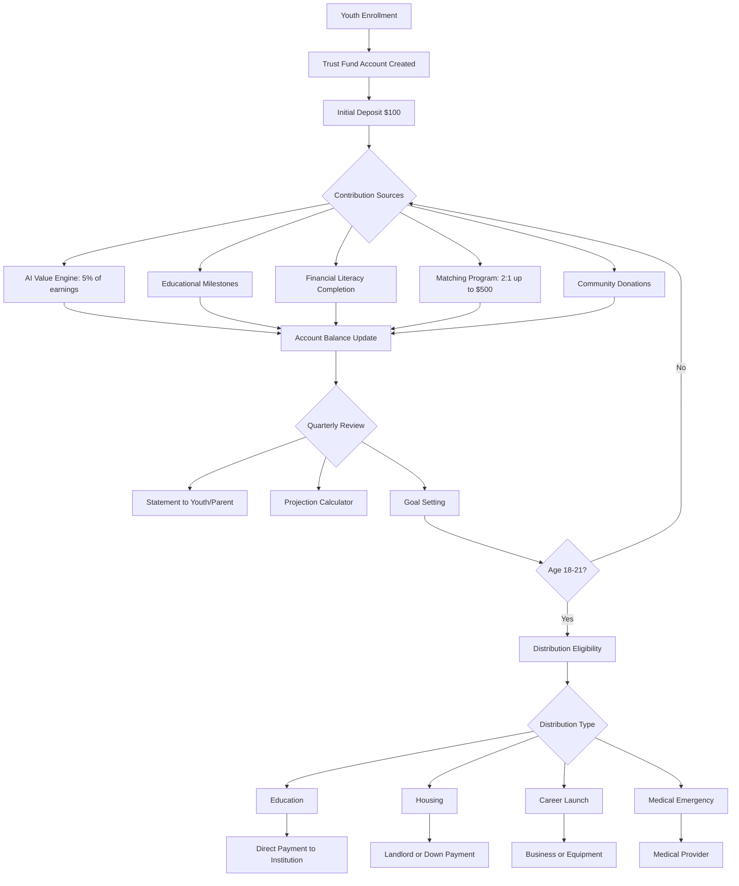

#### Trust Fund Workflow.md


# Protected Youth Trust Fund Workflow

## Overview

The Protected Youth Trust Fund provides every enrolled child with a locked savings account that accumulates contributions from AI Value Engine earnings, milestone achievements, and matching programs.

## Mermaid Diagram



Account Structure

Custodial Arrangement

· Custodian: HSN Trust Fund Board (fiduciary responsibility)
· Beneficiary: Enrolled youth
· Access age: 18 (education/housing/career) or 21 (unrestricted)
· Lock period: No withdrawals before 18 except medical emergency

Account Features

· FDIC-insured (up to $250k)
· Interest-bearing (current rate: 2.5% APY)
· No fees
· Online dashboard for youth/parent
· Monthly text balance updates

Contribution Schedule

Source Frequency Amount Trigger
Initial deposit One-time $100 Enrollment
AI Value Engine Weekly 5% of earnings Automated
Educational milestone Monthly $25-100 Achievement
Financial literacy Upon completion $250 Course pass
Savings match Quarterly 2:1 up to $500 Parent/child savings
Birthday Annual $50 Age increase
Community sponsor Variable Any Donation

Milestone Payment Table

Milestone Age Range Payment
Reading at grade level 5-8 $50
Perfect school month Any $25
Honor roll Any $100
Financial literacy module 13-18 $25 each
Summer job (20+ hours/week) 14-18 $200
Volunteer hours (50+) 13-18 $100
High school graduation 18 $500
College acceptance 18 $250

Distribution Rules

Approved Uses (Age 18-21)

Category Documentation Required Payment Method
College tuition Acceptance letter, bill Direct to school
Trade school Enrollment verification Direct to school
Housing deposit Lease agreement Direct to landlord
First month's rent Lease agreement Direct to landlord
Down payment (first home) Purchase agreement Escrow
Business startup Business plan, license Staged payments
Professional equipment Quote/invoice Direct to vendor

Medical Emergency Exception (Under 18)

· Requires two physician signatures
· HSN Ethics Committee review (48 hours)
· Limited to $5,000 maximum
· Repayment plan for non-emergency use

Quarterly Review Process

Youth Session (30 minutes)

· Review current balance
· Set savings goals
· Choose next milestone to pursue
· Update distribution plan

Parent Session (15 minutes, separate)

· Discuss child's progress
· Review contribution opportunities
· Address any concerns
· Confirm contact information

Combined Session (15 minutes)

· Celebrate achievements
· Align on goals
· Schedule next quarter

Projection Calculator

The AI Trust Fund Projector shows:

```
If you save $X per month and earn Y% interest:
Age 18 balance: $Z
Age 21 balance: $W

This could pay for:
- Community college: 2 years
- State university: 1 year
- Trade school: Full program
- Apartment deposit: +6 months rent
- Business startup: Small business
```

Success Metrics

Metric Target
Enrollment rate 100% of youth
Average balance at 18 $10,000
Milestone completion 80% of opportunities
Distribution to approved uses 95%
Fraud/abuse incidents <0.1%

Integration Points

· Youth Education Workflow - Milestone triggers
· Teen Financial Literacy - Account access education
· AI Value Engine - Automated contributions
· Family Stability - Parent savings matching


