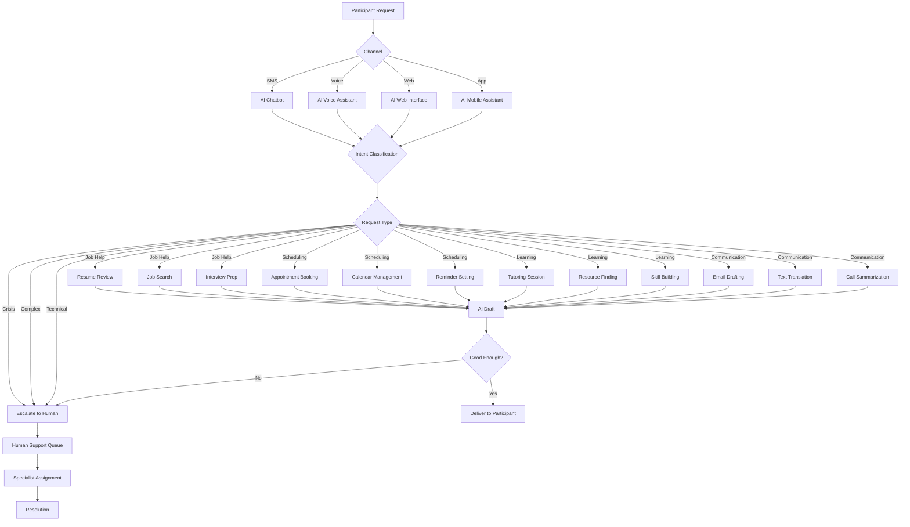

#### AI Support Workflow.md

# AI Support Workflow

## Overview

The AI Support Layer provides 24/7 assistance to participants for job help, scheduling, learning, and communication, with seamless escalation to human support when needed.

## Mermaid Diagram

