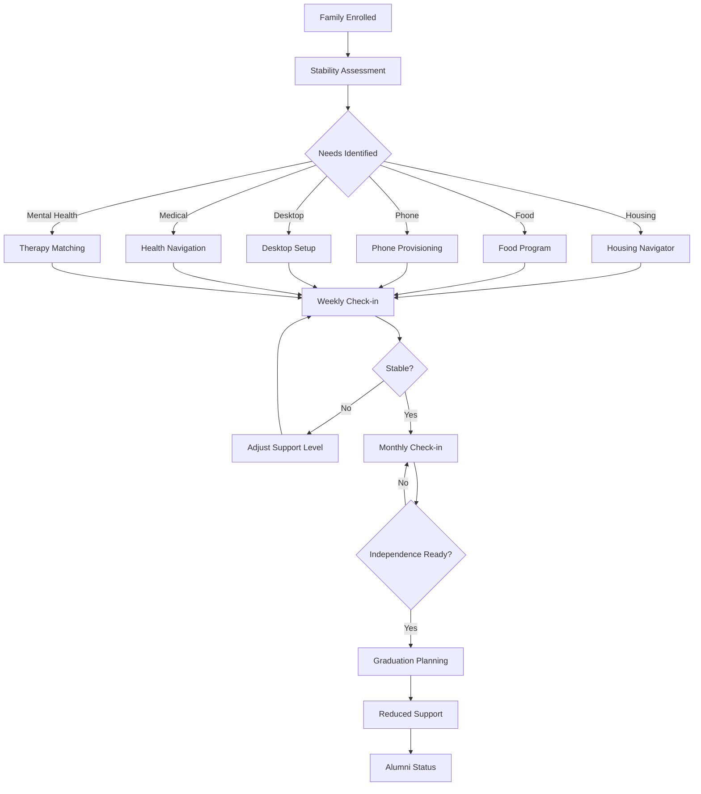

#### Family Stability Workflow.md

# Family Stability Workflow

## Overview

The Family Stability Workflow coordinates all core programs for a household, ensuring holistic support and reducing fragmentation.

## Mermaid Diagram

Weekly Stability Check-in

Day 1: Automated Check (AI)

· Housing status verification (GPS check-in optional)
· Food sufficiency (quick survey)
· Phone/desktop connectivity test
· Appointment attendance confirmation
· Flag anomalies for human review

Day 3: Case Navigator Call (15 minutes)

· Review flagged issues
· Problem-solve barriers
· Adjust upcoming support
· Document in case management system

Day 5: AI Support Layer Check

· Send reminders for upcoming appointments
· Answer non-urgent questions
· Provide resource recommendations
· Schedule next week's check-in

Support Level Adjustment

Stability Score Support Intensity Navigator Contact
0-2 (Crisis) Daily Daily
3-5 (Unstable) High 3x/week
6-8 (Stable) Medium Weekly
9-10 (Thriving) Low Monthly

Family Stability Plan Components

Each family receives a customized plan with:

1. Housing goal (e.g., "Permanent rental within 90 days")
2. Income target (e.g., "$3,000/month household income")
3. Health milestones (e.g., "All children have annual physical")
4. Education benchmarks (e.g., "90% school attendance")
5. Savings goal (e.g., "$1,000 emergency fund")

Crisis Intervention

If stability score drops below 3:

1. Immediate navigator call (within 1 hour)
2. Emergency resource activation (hotel voucher, food delivery)
3. Safety assessment
4. 72-hour stabilization plan
5. Daily check-ins until score improves to 5+

Family Dashboard (Participant View)

· Real-time stability score
· Upcoming appointments
· Benefit balances (food, housing, etc.)
· Trust Fund status (for youth)
· Message center for navigator

Success Metrics

· Time to stability (score 8+): <90 days
· Stability maintenance: >80% at 6 months
· Family reunification (if separated): >70%
· Crisis recurrence: <20%

Integration Points

· Youth Education Workflow - Children's progress tracked
· Trust Fund Workflow - Family milestones trigger contributions
· Medical Access Workflow - Health status integrated

