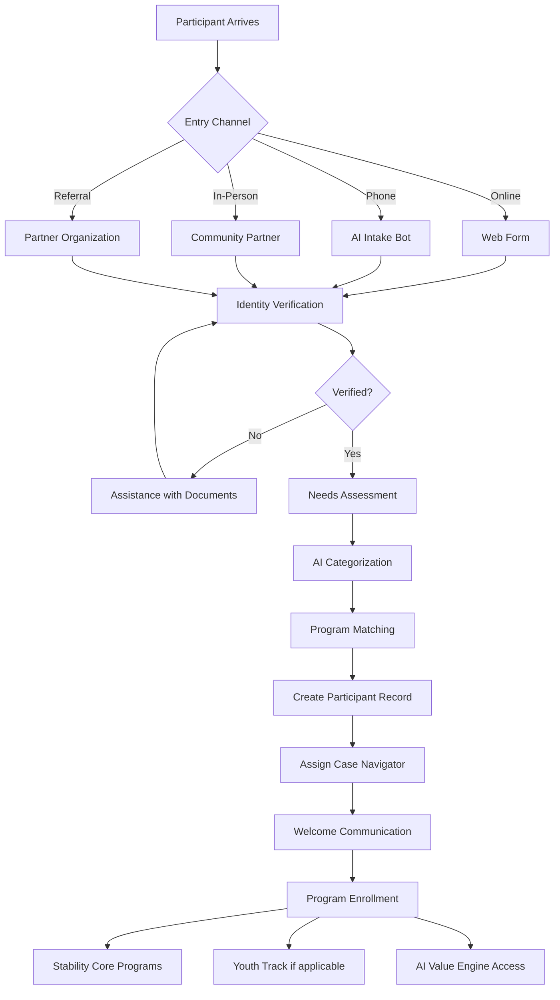

docs/workflows/

Intake Workflow.md

# Intake Workflow

## Overview

The intake process is the single entry point for all HSN programs. It is designed to be low-barrier, trauma-informed, and efficient.

## Mermaid Diagram

Step-by-Step Process

Step 1: Entry (0-15 minutes)

· Online: Web form with AI chatbot assistance
· Phone: Voice menu + AI intake bot (multi-language)
· In-person: Tablet kiosk or staff-assisted
· Referral: API from partner (shelter, school, clinic)

Step 2: Identity Verification (5-10 minutes)

· Name, date of birth, contact information
· Government ID (if available - not required for emergency services)
· Alternative verification for unhoused participants
· Digital signature on program agreements

Step 3: Needs Assessment (15-20 minutes)

· Housing status (street, shelter, temporary, stable)
· Food security (last meal, access concerns)
· Health status (medical, dental, mental health needs)
· Family composition (children, elders, dependents)
· Employment/education status
· Digital access (phone, computer, internet)

Step 4: Program Matching (automated, <1 minute)

· AI algorithm matches needs to available programs
· Prioritizes based on severity and urgency
· Creates personalized stability plan
· Flags for immediate intervention (crisis protocols)

Step 5: Record Creation (2-5 minutes)

· Unique participant ID generated
· Encrypted profile in participant database
· Consent preferences recorded
· Emergency contact (if provided)

Step 6: Assignment (automated, <1 minute)

· Geographic case navigator assigned
· AI support layer activated
· Language preference configured
· Communication channel selected (SMS, email, voice)

Step 7: Welcome & Enrollment (10-15 minutes)

· Welcome email/SMS with participant ID
· Program-specific enrollment forms (auto-filled)
· Schedule first navigator call (within 24 hours)
· Immediate crisis resources (if needed)

Exceptions & Overrides

Scenario Action
No ID Proceed with alternative verification (photo, known partner)
Minor without guardian Child protective services notified, temporary guardian assigned
Immediate danger Bypass intake, direct to emergency services
Language not supported Human interpreter via phone bridge

Intake Form Fields

See Intake Form Template

Success Metrics

· Time from entry to enrollment: <45 minutes average
· Abandonment rate: <10%
· Accuracy of program matching: >90%
· Participant satisfaction: >4.5/5

Integration Points

· AI Support Workflow - Chatbot handles initial triage
· Family Stability Workflow - Seamless handoff
· Trust Fund Workflow - Auto-enrollment for youth

