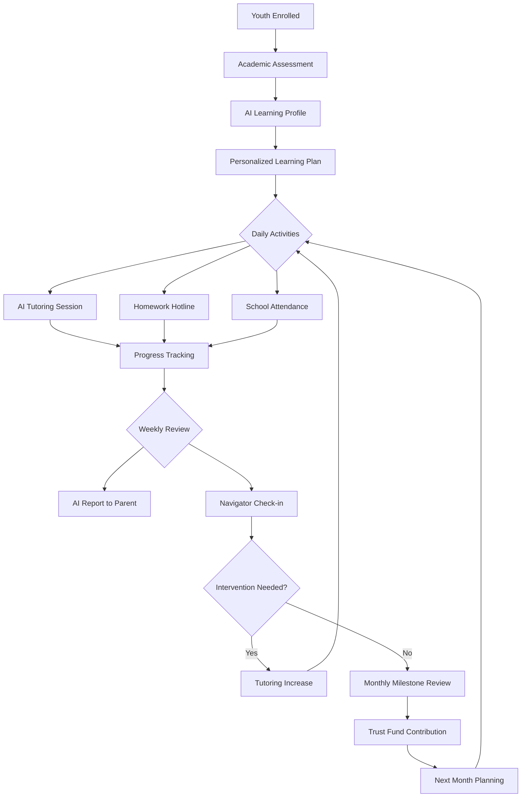

#### Youth Education Workflow.md

# Youth Education Workflow

## Overview

Ensures every child in the HSN system receives consistent educational support, from daily homework help to long-term academic planning.

## Mermaid Diagram

Daily Workflow

Morning (Pre-School)

· AI sends reminder of day's assignments
· Breakfast check-in (food program coordination)
· Backpack check (supplies, completed homework)

School Day

· Attendance monitoring (API with school district)
· Lunch account balance check
· AI tutor available for in-school questions (phone/chat)

After School (3-6 PM)

· Homework help via AI tutor or hotline
· Scheduled tutoring sessions (30-60 minutes)
· Project collaboration tools

Evening (6-8 PM)

· Parent review of day's progress
· AI-generated study plan for next day
· Trust Fund milestone notifications

Weekly Academic Review

Conducted by AI, reviewed by navigator:

Metric Target Intervention if Below
Homework completion 90% Increase tutoring to daily
Assignment quality 80% Subject-specific help
Attendance 95% Truancy intervention
Test scores At grade level Diagnostic assessment
AI tutor engagement 5+ sessions/week Parent coaching

Monthly Milestones

Milestones trigger Trust Fund contributions:

Milestone Contribution
Perfect attendance (month) $50
All homework completed $25
Grade improvement (any subject) $100
Reading level advancement $75
Math fact fluency $50
Positive teacher note $10

School Partnership Integration

· Data sharing agreement with school district
· Teacher portal for direct feedback
· IEP coordination - AI flags accommodations needed
· Parent-teacher conferences - Navigator attendance

Summer Learning (June-August)

· Summer slide prevention program
· 30 minutes daily AI tutoring
· Enrichment activities (coding, art, music)
· Bridge program for struggling students

Transition Workflow

Elementary to Middle School

· Orientation sessions (May)
· Schedule preview
· Lockers and navigation practice
· Peer mentoring assignment

Middle to High School

· Credit tracking setup
· Graduation pathway planning
· Career interest assessment
· Advanced course recommendations

High School to Post-Secondary

· College application support (AI essay review)
· FAFSA completion assistance
· Scholarship search and applications
· Trade school exploration
· Trust Fund distribution planning

Success Metrics

Metric Target
Daily AI tutor usage 70% of school days
Homework completion 90%
Grade improvement (D/F to C+) 80% of struggling students
On-time grade progression 95%
High school graduation 90%

Integration Points

· Trust Fund Workflow - Milestone contributions
· Family Stability Workflow - Household educational culture
· Teen Financial Literacy - Ages 13+ transition

