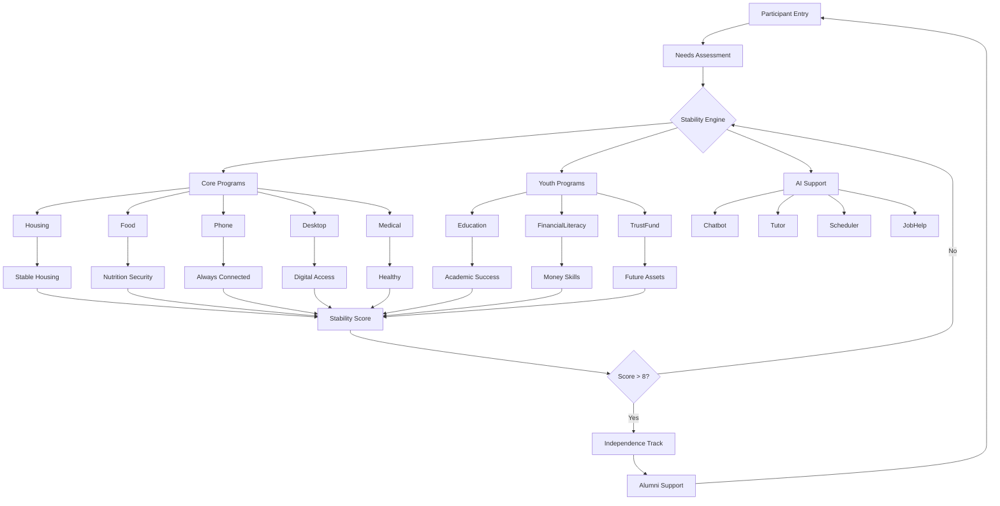

Stability Engine Diagram.md

# Stability Engine Diagram

## Mermaid Diagram

```mermaid
flowchart TD
    Start[Participant Entry] --> Input[Needs Assessment]
    
    Input --> Engine{Stability Engine}
    
    Engine --> Core[Core Programs]
    Core --> Housing
    Core --> Food
    Core --> Phone
    Core --> Desktop
    Core --> Medical
    
    Engine --> Youth[Youth Programs]
    Youth --> Education
    Youth --> FinancialLiteracy
    Youth --> TrustFund
    
    Engine --> AI[AI Support]
    AI --> Chatbot
    AI --> Tutor
    AI --> Scheduler
    AI --> JobHelp
    
    Housing --> Output1[Stable Housing]
    Food --> Output2[Nutrition Security]
    Phone --> Output3[Always Connected]
    Desktop --> Output4[Digital Access]
    Medical --> Output5[Healthy]
    
    Education --> Output6[Academic Success]
    FinancialLiteracy --> Output7[Money Skills]
    TrustFund --> Output8[Future Assets]
    
    Output1 --> Stability[Stability Score]
    Output2 --> Stability
    Output3 --> Stability
    Output4 --> Stability
    Output5 --> Stability
    Output6 --> Stability
    Output7 --> Stability
    Output8 --> Stability
    
    Stability --> Threshold{Score > 8?}
    Threshold -->|No| Engine
    Threshold -->|Yes| Graduation[Independence Track]
    
    Graduation --> Alumni[Alumni Support]
    Alumni --> Start
```

