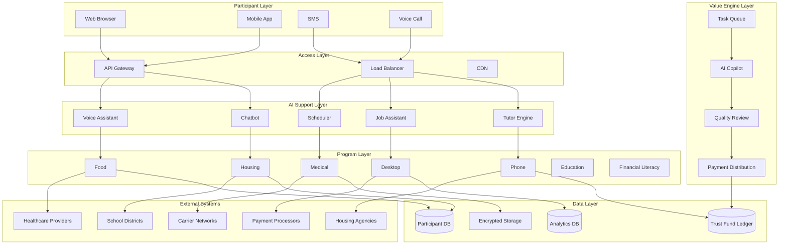

### docs/diagrams/

#### System Architecture Diagram.md


# System Architecture Diagram

## Mermaid Diagram


```mermaid
graph TB
    subgraph "Participant Layer"
        P1[Web Browser]
        P2[Mobile App]
        P3[SMS]
        P4[Voice Call]
    end
    
    subgraph "Access Layer"
        A1[API Gateway]
        A2[Load Balancer]
        A3[CDN]
    end
    
    subgraph "AI Support Layer"
        AI1[Chatbot]
        AI2[Voice Assistant]
        AI3[Tutor Engine]
        AI4[Job Assistant]
        AI5[Scheduler]
    end
    
    subgraph "Program Layer"
        PR1[Housing]
        PR2[Food]
        PR3[Phone]
        PR4[Desktop]
        PR5[Medical]
        PR6[Education]
        PR7[Financial Literacy]
    end
    
    subgraph "Value Engine Layer"
        VE1[Task Queue]
        VE2[AI Copilot]
        VE3[Quality Review]
        VE4[Payment Distribution]
    end
    
    subgraph "Data Layer"
        D1[(Participant DB)]
        D2[(Trust Fund Ledger)]
        D3[(Analytics DB)]
        D4[Encrypted Storage]
    end
    
    subgraph "External Systems"
        E1[School Districts]
        E2[Healthcare Providers]
        E3[Housing Agencies]
        E4[Payment Processors]
        E5[Carrier Networks]
    end
    
    P1 --> A1
    P2 --> A1
    P3 --> A2
    P4 --> A2
    
    A1 --> AI1
    A1 --> AI2
    A2 --> AI3
    A2 --> AI4
    A2 --> AI5
    
    AI1 --> PR1
    AI2 --> PR2
    AI3 --> PR3
    AI4 --> PR4
    AI5 --> PR5
    
    PR1 --> D1
    PR2 --> D1
    PR3 --> D2
    PR4 --> D3
    PR5 --> D4
    
    VE1 --> VE2
    VE2 --> VE3
    VE3 --> VE4
    VE4 --> D2
    
    PR1 --> E1
    PR2 --> E2
    PR3 --> E3
    PR4 --> E4
    PR5 --> E5
```

```
